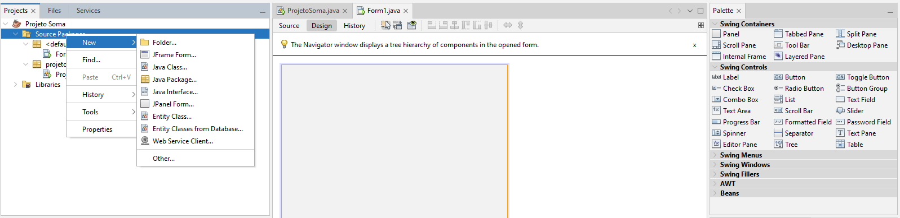

# INICIO DOS ESTUDOS EM JAVA DANKI CODE
### 27/11/2024 - Modulo 1 

Aula 1 - Introdução ao Netbeams

O _**NetBeams**_ é a IDE que utiliza Java para criar interfaces para suas aplicações. Para isso:

> Clicamos com o botão direito do mouse em "Source Package"

